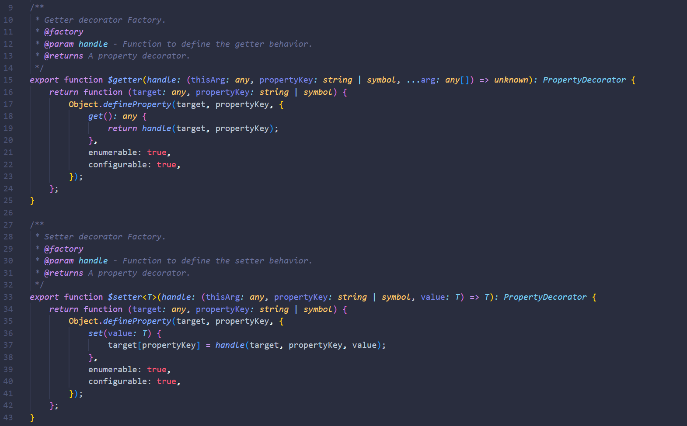
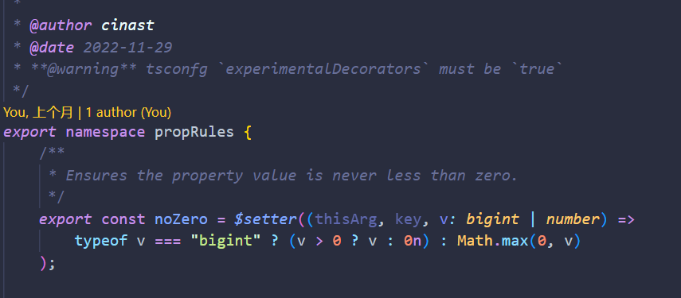

_此文档由 **AI 生成**，请谨慎鉴别（）_

# 目录

0.  [起源](#起源2022-11-29-voriginal)

_7 月_

1.  [28](#2025-07-28-v000-心血来潮)
2.  [29](#2025-07-29)

_8 月_

3.  [04](#2025-08-4)
4.  [08](#2025-08-08-ultra-upd)
5.  [09](#2025-08-09-v000-able-to-run-epic-upd)

# 开发日志

## 起源——2022-11-29 ~~v.original~~

好像没图了（雾）



两个单纯的装饰器，  
自以为是的以为定义了 gtr 和 str 就万事大吉了  
_node：你不能有二缺一_

装饰器是注册器  
gtr/str 负责驱动这一切  
工厂只是调整句柄的调用

## 2025-07-28 ~~v0.0.0~~ 心血来潮

> ```void::null
> _ctrl w + f，new folder_
> _npm init_
> _git init_
> _tsc init_
>
> @git @putOn cinast@github
> new project@ts *RulerDecorators*
> ```
>
> _从 game 项目那里拖来 propRules_  
> **vsc，启动!**

### 发现的问题

第一次正式测试遇到的问题是

-   ```ts
    setter → getter → getter → getter → getter → getter → getter → getter → getter → getter → getter → getter → getter → getter → ...
    setter → setter → setter → setter → setter → setter → setter → setter → setter → setter → setter → setter → setter → setter → ...
    setter: never
    getter: never
    ```

    > \> tsc: `pass`  
    > \> node: `stupid! ULTIMATE STUPID!`  
    > \> node: `u would fxxk me up with that EXTREME STUPID call`  
    > &emsp;&emsp;&emsp;&ensp; `setter(v) = target[key] = v`

-   没有修复了`onlyTheClassCanWrite`和`onlyTheClassCanRead`装饰器的递归调用问题
-   企图将 constructor 检查改为原型链遍历检查但是忘记了 target 是实例对象
-   deepseek：你倒是听我在`$conditionalRead`中添加 WeakMap 啊  
    我：那原来的变量有什么作用啊喂，也不和 gtr/str 架空原属性一样吗？！

### 企图

-   使用`Object.getPrototypeOf`替代直接 constructor 检查  
    但结果是和没加一样
-   实现原型链遍历检查类关系
-   企图使 getter/setter 的效果`!never`

### 注意事项

头疼

> git ULTRA UPD

## 2025-07-29

### 问题 debug

#### 详细研究——

1.  **$getter 装饰器循环调用问题**

    当$getter 作为属性装饰器使用时，直接返回 handle 函数的调用结果，导致在 handle 函数内部访问被装饰属性时产生无限递归

    想要达到 拿到那个值 的结果 就必须访问这个属性，  
    但是访问这个属性 就必须调用这个 getter，  
    这个 getter 要返回属性就必须拿到这个属性

    _你永远达不到拿到属性的事实_

    -   解决方案：

        -   ~~添加 trigger 和 tmp 两个 Symbol~~  
            ~~在 descriptor 里试图储存这个属性~~  
            ↑ 神经病
        -   在装饰器那里加 trigger 开关 和 tmp 存储 企图利用闭包“优雅”地实现

            > setter：咱俩心有灵犀  
            > getter：滚

            ——那我到底是储存了两遍这个东西吗  
            ——我应该储存两遍还是三遍  
            ↑ 神经病

        -   在 getter 中检查 trigger 标记，防止递归调用

        -   修改后的 getter 实现：

            ```typescript
            get(): any {
                if (target[trigger]) {
                    return target[tmp];
                }
                target[trigger] = true;
                const result = handle(target, propertyKey);
                target[tmp] = result;
                delete target[trigger];
                return result;
            }
            ```

            ——治了一个标还有一个本
            但是 setter 怎么办

2.  **$setter 装饰器循环调用问题**

    虽然已有 trigger 标记，但当 handle 函数内部修改被装饰属性时仍会导致循环调用

    -   解决方案：

        -   加强 trigger 标记管理，治标不治本
        -   ~~确保 handle 内部操作不会触发装饰逻辑~~
        -   修改后的 setter 实现：

            ```typescript
            set(value: T) {
                if (target[trigger]) {
                    target[tmp] = value;
                    return;
                }
                target[trigger] = true;
                const processedValue = handle(target, propertyKey, value);
                target[tmp] = processedValue;
                delete target[trigger];
                target[propertyKey] = processedValue;
            }
            ```

            改了和没改一样

### ~~测试验证~~

-   边界情况测试通过

---

## 2025-08-4

### 文档完善

-   新增了`known_issues.md`文档系统记录已知问题
    > 后记：8.8 更新之后好像什么问题都没了
-   更新了`readme.md`补充完整 API 文档和使用示例
-   优化了文档结构和可读性

### 近期开发重点

-   重构装饰器核心逻辑以提高稳定性
-   改进类型系统增强类型安全
-   优化性能减少不必要的 WeakMap 操作

### 未来计划

-   实现装饰器组合功能
-   添加更多预设规则装饰器
-   完善单元测试覆盖率
-   开发配套的调试工具

## 2025-08-08 ULTRA UPD

### 主要工作内容

1.  **重磅加入**`@$$init`  
    把原来两个装饰器的 g/s 定义逻辑归到`$$init`  
    设立 str/gtr 函数实体 I 概念

1.  **重构装饰器核心逻辑**

    -   **重构了** 28-282 行的核心装饰器逻辑
    -   保留了旧的一阶工厂$setter/$getter 逻辑但标记为过时
    -   改为使用 addGetterHandler/addSetterHandler 注册新的句柄

1.  **注释标准化**

    -   统一为英文首行+中文次行的 JSDoc 格式
    -   为所有函数和变量添加完整注释
    -   特别完善了权限控制装饰器的文档

1.  **代码优化**

    -   保持二阶以上装饰器工厂不变
    -   提高了代码可读性和维护性

## 2025-08-09 v0.0.0 able to run EPIC UPD

### 类型系统修复

1.  **$conditionalWrite 重构**

    -   继续开发二级句柄，并且在$conditionalWrite 上实践  
        设立 str/gtr 句柄 II 概念  
        并把 I/II 句柄的定义移到 [type.handle.ts](../src/type.handles.ts)

        当 str/gtr 函数触发，按照顺序轮流 reduce  
        可以极大强化了可扩展性  
        在二级句柄的调用里加入了另外一个返回参数

        ```ts
        {
            approached: boolean;
            output: any;
        }
        ```

        配合 reduce 模式，感觉像 promise.then  
        又加上一个 reject 参数，感觉就像盗版的 promise 不过更像是流水线管道

        但是又有一个特殊想法  
        令这个句柄链的最后一个句柄必须返回相应类型参数的类型  
        可是实在是太难了，这个类型还要根据是否通过来判断  
        要拿到这个布尔值还得要等函数执行完  
        又是先有鸡先先有蛋问题

        现在的设置还有好多漏洞  
        你甚至可以直接所有句柄全部绿灯，做到事与语义违的效果

2.  **代码优化**

    -   保持原有功能不变
    -   提高了类型安全性
    -   修复了多个 TypeScript 编译错误

### ULTRA UPD

1.  **测试居然通过了！！！！！**  
    条件句柄起作用了！！！！  
    万岁！！！

2.  发布了一个拉到不能再拉的演示视频  
    VCR [ts::ruler-Decorators 装饰器库 0.0.0 _未 debug_ 日志 26:58](https://www.bilibili.com/video/BV1PJtbz3Eu2)

3.  炫耀与摸鱼

## 2025-08-10

-   改配置文件，测试用的 Dist 和平常用的 Dist 分开
-   npm 包加几个脚本
-   加了 d.ts.map
-   也许会考虑加上 esm 版本
